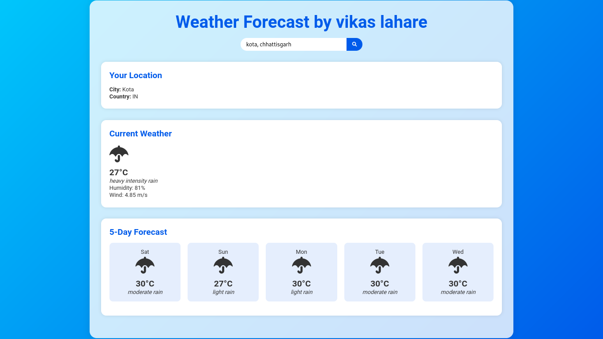

# Responsive-WeatherForCasting

# **Languages:**
> HTML CSS JAVASCRIPT ``I'm using internal css and javascript so remember this``

```
git clone https://github.com/CryptoQuestVikas/Responsive-WeatherForCasting
cd Responsive-WeatherForCasting
```
# Instructions:
> 1. Go to this website ``https://api.openweathermap.org/``
> 2. And Signup or Login
> 3. Afterall go to ``My Account`` and click ``My API Key``
> 4. Then Copy you'r ``API Key``
> 5. Go to Your website javascript and paste ``API Key``
> 6. Enjoy it...

# **Screenshot**

